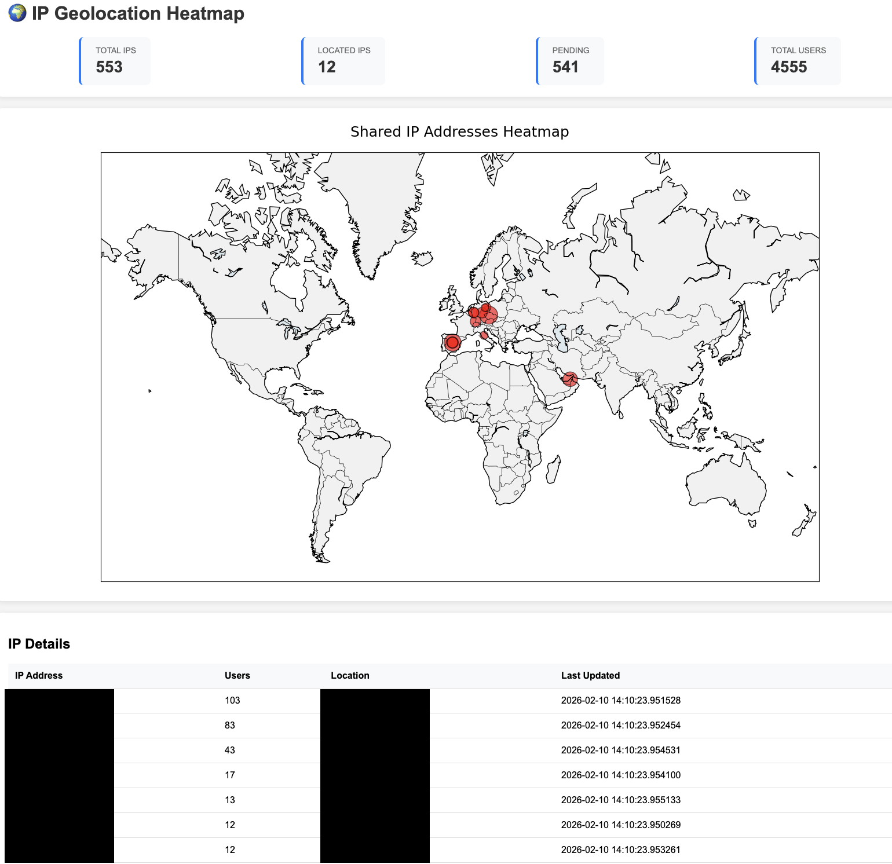

# IP Geolocation Heatmap

Track and visualize shared IP addresses from Keycloak sessions.



## Prerequisites

Current config uses **GCP hosted PostgreSQL** but can be refactored to use other databases.

For GCP setup:
```bash
gcloud auth login --update-adc
```

## Quick Start

```bash
# Setup your venv
python3 -m venv .venv
source .venv/bin/activate.fish

# Install dependencies
pip install -r requirements.txt

# Run
./run.sh
```

Visit: `http://localhost:8000`

## How It Works

1. **Scheduler** - Collects IP data from Keycloak every hour
2. **Geolocation** - Fetches location data (1 req/sec, skips already-fetched IPs)
3. **Web UI** - Shows heatmap with statistics

## Files

- `scheduler.py` - Background data collection
- `web.py` - Web interface
- `database.py` - SQLite operations
- `templates/` - HTML templates
- `static/` - CSS files

## Config

Create your `.env` file with:
```
DB_INSTANCE_CONNECTION_NAME=your-instance
DB_NAME=your-database
DB_USER=your-user
DB_PASSWORD=your-password
DB_SCHEMA=your-schema
KC_REALM_ID=your-realm-id
```

## Deployment

This script can be deployed as a **sidecar container** alongside Keycloak. However, a refactoring of environment variables is needed to match secrets consumed by Keycloak (e.g., using Kubernetes secrets/ConfigMaps instead of `.env` file).